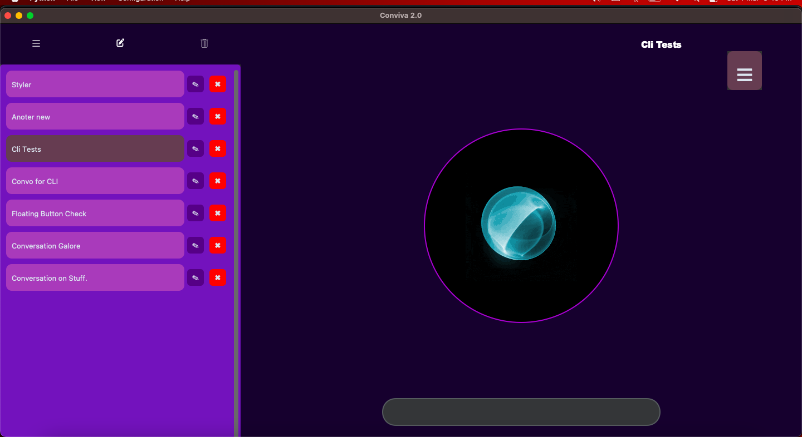
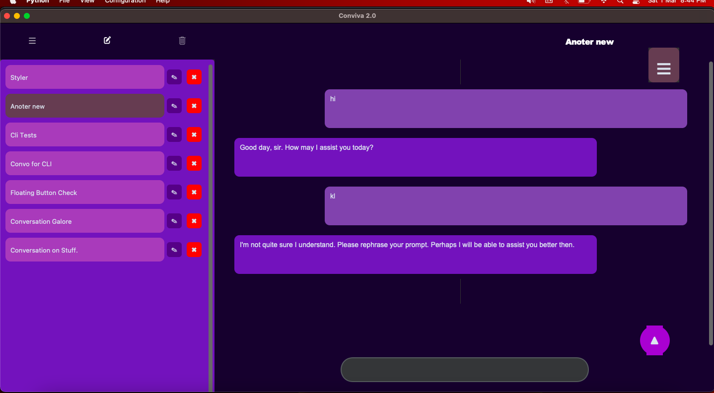

---
---

# Conviva 2.0 – GUI AI Assistant

|                           |                  |
| ------------------------- | ---------------- |
|  |  |

Conviva 2.0 – GUI AI Assistant is a robust graphical application that leverages AI to provide an interactive, conversational experience. Building upon the powerful CLI version, the GUI version offers a visually rich interface with dynamic media handling, speech synthesis, conversation management, and more.

---

## Table of Contents

- [Overview](#overview)
- [Features](#features)
- [Architecture & Modules](#architecture--modules)
  - [GUI Framework](#gui-framework)
  - [Conversation Management](#conversation-management)
  - [LLM & Tools Integration](#llm--tools-integration)
  - [Media & Speech Processing](#media--speech-processing)
  - [UI Components](#ui-components)
- [Installation](#installation)
- [Usage](#usage)
- [Configuration](#configuration)
- [Future Improvements](#future-improvements)

---

## Overview

Conviva 2.0 – GUI AI Assistant delivers a seamless, interactive experience through a modern, drag-and-drop graphical interface. Users can converse with the AI assistant via text or speech, analyze media files (images and audio), and manage conversation histories—all in a visually engaging environment powered by Tkinter and CustomTkinter.

---

## Features

- **Interactive Conversations:** Engage in dynamic dialogues with the AI using text input or speech commands.
- **Media Analysis:** Easily upload images or audio files via drag-and-drop to perform media analysis.
- **Speech Synthesis & Audio Playback:** Integrated text-to-speech capabilities (using pyttsx3 or the macOS `say` command) along with audio playback via `sounddevice` and `librosa`.
- **Conversation Management:** Create, edit, delete, and switch between multiple conversations stored as JSON files.
- **Dynamic UI Elements:** Enjoy responsive layouts featuring a pulser animation, floating buttons, modals for input, toast notifications, and customizable side panels.
- **Cross-Platform Functionality:** Designed to work seamlessly on macOS, Windows, and Linux with platform-specific optimizations.

---

## Architecture & Modules

### GUI Framework

The application leverages Tkinter enhanced with CustomTkinter and TkinterDnD2 for a modern, responsive UI. This includes dynamic resizing, drag-and-drop file support, and modal dialogs.

### Conversation Management

- **History Storage:** Conversation histories are maintained in JSON files.
- **Dynamic Loading:** Conversations are sorted by timestamp and loaded into the UI on demand.
- **Management Actions:** Users can create, edit, or delete conversation sessions through an intuitive sidebar and context menus.

### LLM & Tools Integration

- **LLM Processing:** Integrated with the `llm_processing` module to handle user queries, media analysis, and AI-generated responses.
- **Extra Arguments:** Supports additional parameters for image and audio analysis to extend functionality based on file type.

### Media & Speech Processing

- **Text-to-Speech:** Uses `pyttsx3` on non-macOS platforms or the native `say` command on macOS to convert text into audio.
- **Audio Playback:** Processes and plays audio files with `sounddevice` and `librosa`.
- **File Handling:** Automatically detects file types (images or audio) on drag-and-drop and initiates appropriate analysis.

### UI Components

- **Side Panel & Floating Buttons:** A toggleable sidebar and floating button list allow quick navigation between chat modes.
- **Dynamic Input Fields:** Automatically switches between an entry widget and a multi-line textbox based on user input length.
- **Animated Feedback:** A pulser animation and GIF playback provide visual feedback during speech synthesis.
- **Modals & Toasts:** Custom modals for conversation title entry and toast notifications for temporary messages.

---

## Installation

1. **Clone the Repository:**

   ```bash
   git clone -b gui --single-branch https://github.com/Programming-Sai/Conviva-v-2.0.git
   cd Conviva-v-2.0
   ```

2. **Set Up a Virtual Environment (Recommended):**

   ```bash
   python -m venv venv
   source venv/bin/activate  # On Windows: venv\Scripts\activate
   ```

3. **Install Dependencies:**

   ```bash
   pip install -r requirements.txt
   ```

4. **Configure Environment Variables:**
   Create a `.env` file in the project root and add your Groq API key:
   ```env
   GROQ_API_KEY=your_groq_api_key_here
   ```

---

## Usage

To launch the GUI application, simply run:

```bash
python GUI.py
```

The GUI window will open, displaying a dynamic interface with side panels, floating navigation buttons, and media support. Use the input fields to converse with the AI, drag and drop media files for analysis, and manage your conversation history using the sidebar.

---

## Configuration

- **Default Voice & Screen:** Customize default settings such as the default voice and starting screen through the configuration menu.
- **Sidebar Options:** Toggle the visibility of the sidebar for a personalized workspace.
- **Keyboard Shortcuts:** Use predefined keyboard shortcuts (e.g., Ctrl+N for new conversation, Ctrl+U for file uploads) to enhance your workflow.

---

## Future Improvements

- **Standalone Packaging:** Develop standalone executables for easier distribution.
- **Enhanced Speech Integration:** Improve speech recognition and synthesis features across platforms.
- **Advanced Media Analysis:** Expand the range of supported media analysis features.
- **UI Enhancements:** Further refine animations, themes, and additional customization options.

---
