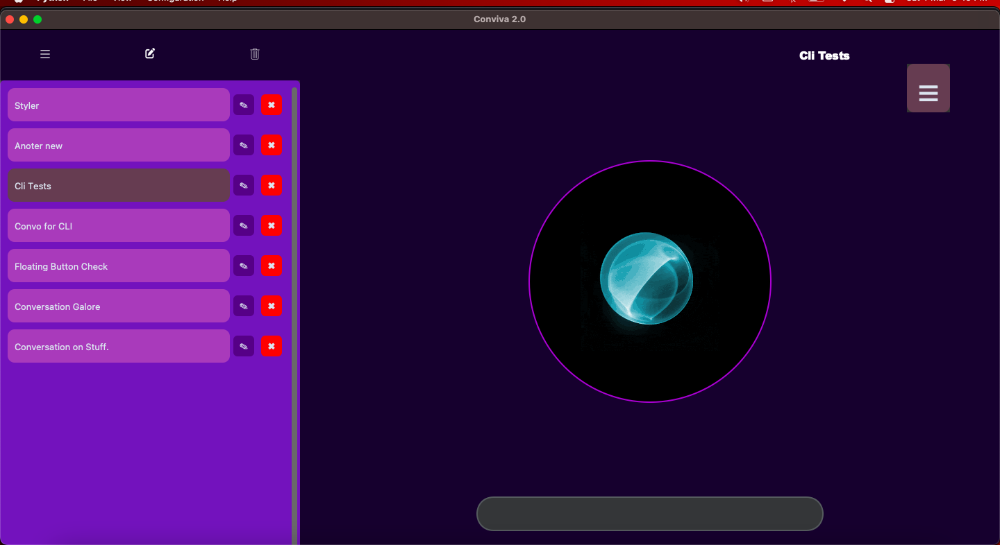
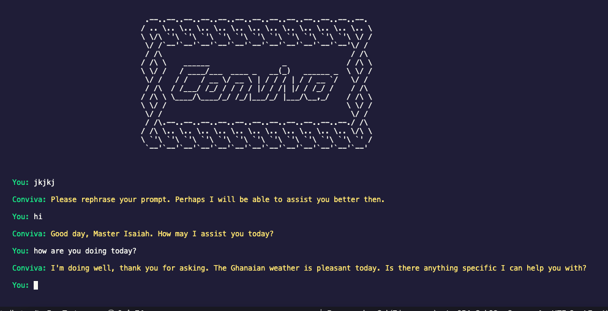

# Conviva 2.0 – AI Assistant

Conviva 2.0 is a versatile AI assistant that offers both a command-line (CLI) and a graphical user interface (GUI) to cater to different user preferences. Whether one enjoys the efficiency of a text-based interface or the richness of a visual environment, Conviva 2.0 provides a seamless experience for interacting with AI-powered tools, media analysis, and conversation management.

|                                  |                                   |
| -------------------------------- | --------------------------------- |
|  |  |

---

## Table of Contents

- [Overview](#overview)
- [Features](#features)
- [Architecture](#architecture)
- [Installation](#installation)
- [Usage](#usage)
  - [CLI](#cli)
  - [GUI](#gui)
- [Future Improvements](#future-improvements)
- [License](#license)

---

## Overview

Conviva 2.0 brings together the power of AI with flexible user interfaces. At its core, the assistant leverages advanced language models and multimedia processing to help you with tasks ranging from answering queries and performing calculations to analyzing images and audio files. The project is designed to be modular, so both the CLI and GUI share the same backend functionality while offering tailored user experiences.

---

## Features

- **Interactive Conversations:** Engage in dynamic dialogues through natural language, whether via text input in the CLI or an interactive GUI.
- **Media Analysis:** Easily upload images or audio files for AI-powered analysis.
- **Speech Synthesis:** Convert text to speech for an immersive, audible interaction.
- **Conversation Management:** Create, edit, delete, and search through conversation histories stored as JSON files.
- **Dual Interfaces:** Choose the streamlined efficiency of the CLI or the visual and interactive experience of the GUI.
- **Responsive UI Components:** Enjoy features such as animated pulser effects, drag-and-drop file handling, floating buttons, and context-aware modals in the GUI.

---

## Architecture

Conviva 2.0 is built with a focus on modularity and scalability:

- **Core AI and Tool Integration:** Both interfaces utilize the same underlying AI processing modules for consistent responses and media analysis.
- **CLI Module:** Offers a command-line experience with conversation history management, tool invocation, and file operations.
- **GUI Module:** Developed with Tkinter and CustomTkinter, providing an intuitive graphical layout with dynamic elements like side panels, floating buttons, and animated feedback.
- **Settings & Configuration:** User preferences, such as default voices and screen modes, are managed via JSON files, ensuring a personalized experience across sessions.

---

## Installation

Follow these steps to set up Conviva 2.0:

1. **Clone the Repository:**

   ```bash
   git clone https://github.com/Programming-Sai/Conviva-v-2.0.git
   cd Conviva-v-2.0
   ```

2. **Set Up a Virtual Environment (Recommended):**

   ```bash
   python -m venv venv
   source venv/bin/activate  # On Windows: venv\Scripts\activate
   ```

3. **Install Dependencies:**

   ```bash
   pip install -r requirements.txt
   ```

4. **Configure Environment Variables:**
   Create a `.env` file in the project root and add your configuration (e.g., your API key):
   ```env
   GROQ_API_KEY=your_groq_api_key_here
   ```

---

## Usage

### CLI

For a text-based experience, run the CLI version:

```bash
python CLI.py
```

The CLI supports conversation management, media uploads, and tool integration. For detailed command options, refer to the [CLI-specific documentation](https://github.com/Programming-Sai/Conviva-v-2.0/blob/cli/README.md).

### GUI

For a graphical experience, launch the GUI version:

```bash
python GUI.py
```

The GUI features interactive elements such as drag-and-drop file handling, animated visual feedback, and customizable conversation panels. Detailed usage instructions are available in the [GUI documentation](https://github.com/Programming-Sai/Conviva-v-2.0/blob/gui/README.md).

---

## Future Improvements

- **Standalone Packaging:** Develop executable packages for easier distribution.
- **Enhanced AI Integration:** Expand the range of supported AI functionalities and media analysis features.
- **Improved Speech & Media Processing:** Optimize speech synthesis, audio playback, and image analysis for better performance.
- **UI Enhancements:** Further refine the graphical interface with additional themes, animations, and user customization options.

---
